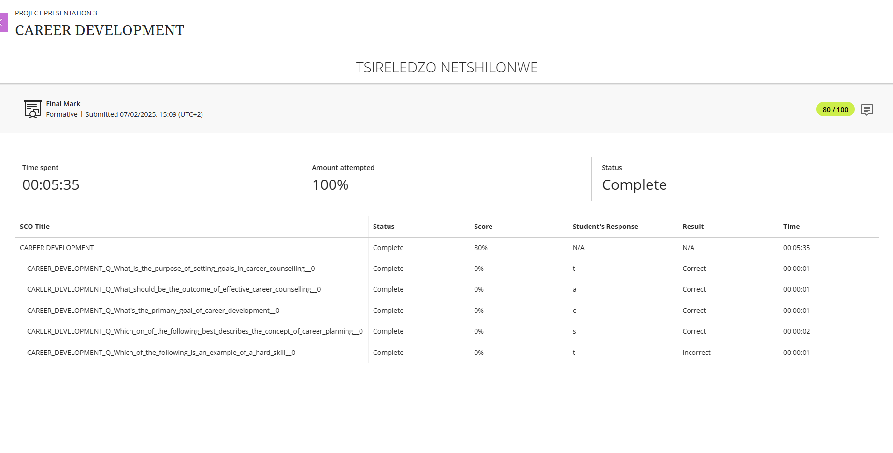
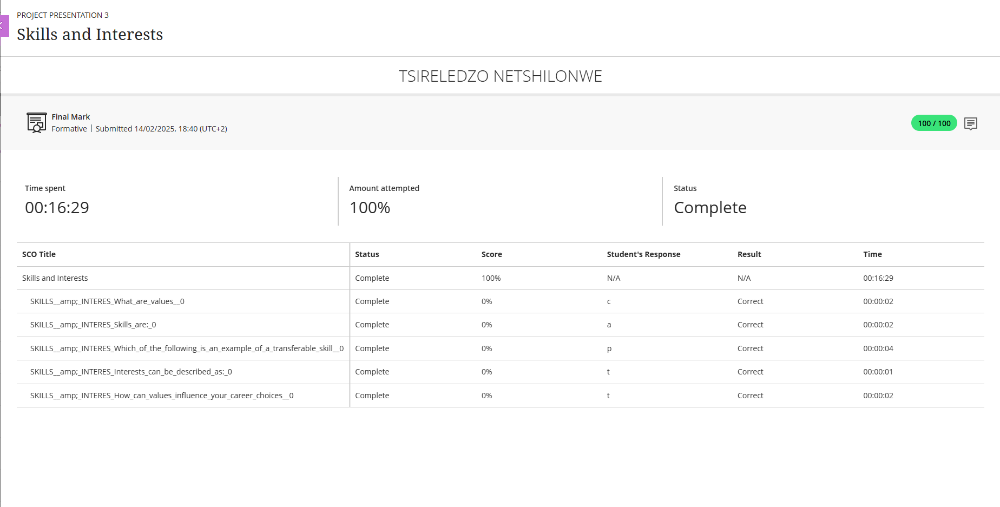
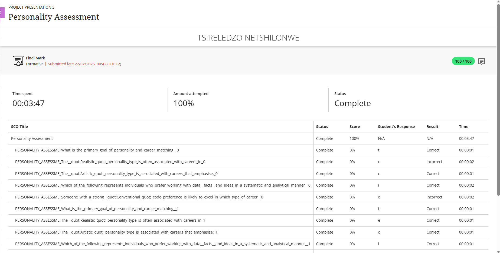

# 🎓 Digital Portfolio – Tsireledzo Netshilonwe

Welcome to my **Work Readiness Training Digital Portfolio**, created as part of my **Diploma in ICT – Applications Development** at the **Cape Peninsula University of Technology (CPUT)**.

This portfolio highlights my academic journey, professional growth, and personal development throughout the **Work Readiness Training** module.

> 💬 *“Learning is not attained by chance; it must be sought for with ardor and attended to with diligence.” – Abigail Adams*

---

## 🧭 Table of Contents
- [📌 Overview](#-overview)
- [👋 Welcome](#-welcome)
- [📚 Explore My Portfolio](#-explore-my-portfolio)
- [📎 Artefacts](#-artefacts)
- [🧠 STAR Reflection Format](#-star-reflection-format)
- [🌱 Key Learnings & Growth](#-key-learnings--growth)
- [🔗 Connect With Me](#-connect-with-me)

---

## 📌 Overview

| **Name** | Tsireledzo Netshilonwe |
|-----------|------------------------|
| **Institution** | Cape Peninsula University of Technology |
| **Programme** | Diploma in ICT – Applications Development |
| **Year** | 3rd Year |

---

## 👋 Welcome

Hello and welcome! 👋  
This portfolio is a reflection of my professional and academic development during the **Work Readiness Training** module.

It documents my progress through key exercises and artefacts that helped me:
- Understand my career goals  
- Identify strengths and areas for growth  
- Build a professional CV  
- Reflect on my personal development

> 🧩 *This journey has not only improved my professional readiness but also deepened my self-awareness as a future ICT professional.*

---

## 📚 Explore My Portfolio

Each section includes an artefact and reflection that represent a key part of my personal and career development:

| Section | Description |
|----------|--------------|
| [💼 **Career Counselling**](./career-counselling/README.md) | Exploring my career path and aligning it with my goals. |
| [🛠️ **Skills & Interests**](./skills-interests/README.md) | Self-assessment of skills and interests shaping my direction. |
| [🧠 **Personality Assessment**](./personality-assessment/README.md) | Insights into how I collaborate, communicate, and lead. |
| [📝 **Create a CV**](./cv/README.md) | Learning the process of building a professional CV. |
| [📬 **CV Submission**](./create-cv/README.md) | Reflecting on the submission and feedback experience. |

---

## 📎 Artefacts

Here are key artefacts that support my learning journey:

| Artefact | Preview | Description |
|-----------|----------|--------------|
| 📄 **Career Counselling Worksheet** |  | Understanding my ideal career path and professional goals. |
| 📊 **Skills & Interests Exercise** |  | Identifying strengths, weaknesses, and key development areas. |
| 🧾 **Personality Assessment Report** |  | Gaining insights into my work style and collaboration approach. |
| 📜 **My CV (PDF)** | [View My CV](./asssets/Tsireledzo_Netshilonwe_CV.pdf) | My first professional CV, built using feedback and reflection. |

> ⚠️ *Make sure the folder name is `assets/` (not `asssets/`) for images to display correctly.*

---

## 🧠 STAR Reflection Format

All my reflections use the **STAR** method for structured insight:

| Step | Description |
|------|--------------|
| **S** – *Situation* | The context of the experience |
| **T** – *Task* | What I aimed to achieve |
| **A** – *Action* | What I did to complete the task |
| **R** – *Result* | What I learned or accomplished |

### Example:
**Situation:** During the career counselling workshop, I explored my long-term professional interests.  
**Task:** To identify a career path aligned with my skills and passions.  
**Action:** I completed a self-assessment quiz and discussed the results with a mentor.  
**Result:** I discovered my strength in analytical thinking and teamwork, leading me to focus on software development roles.

---

## 🌱 Key Learnings & Growth

Throughout this module, I developed both professional and personal insights:

- ✅ Improved self-awareness regarding my personality and career preferences.  
- 💼 Learned how to communicate my strengths effectively through a CV.  
- 🧭 Gained clarity about my short- and long-term career goals.  
- 🤝 Enhanced my professional readiness for the ICT industry.  

> 🌟 *This journey has helped me prepare for the transition from student to professional life.*

---

## 🔗 Connect With Me

| Platform | Link |
|-----------|------|
| 🌐 **GitHub** | [github.com/tsireledzonetshilonwe](https://github.com/tsireledzonetshilonwe) |
| 💼 **LinkedIn** | [linkedin.com/in/tsireledzo-netshilonwe-38a1162b9](https://www.linkedin.com/in/tsireledzo-netshilonwe-38a1162b9/) |

> ✨ *Thank you for exploring my portfolio! Feel free to connect or share feedback.*

---

🧩 *© 2025 Tsireledzo Netshilonwe – Cape Peninsula University of Technology*

